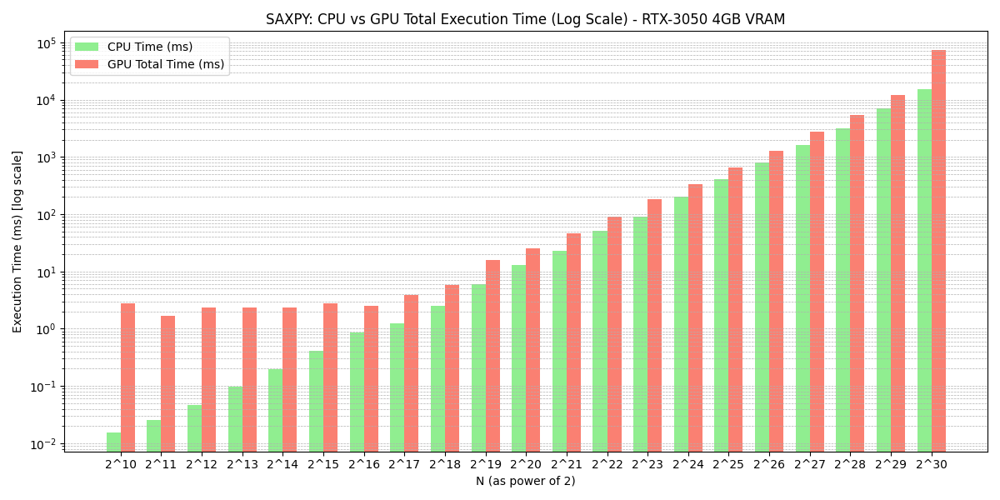
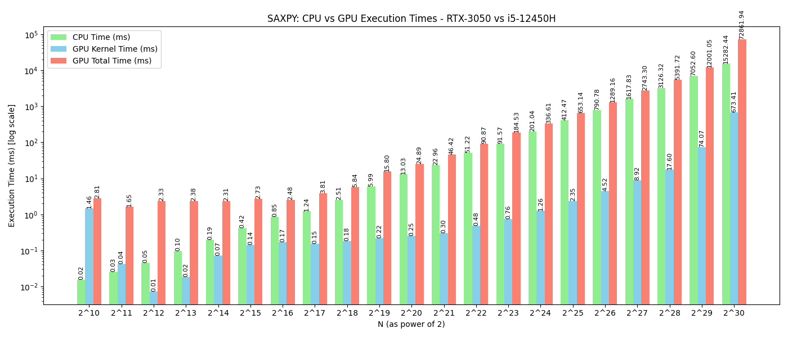
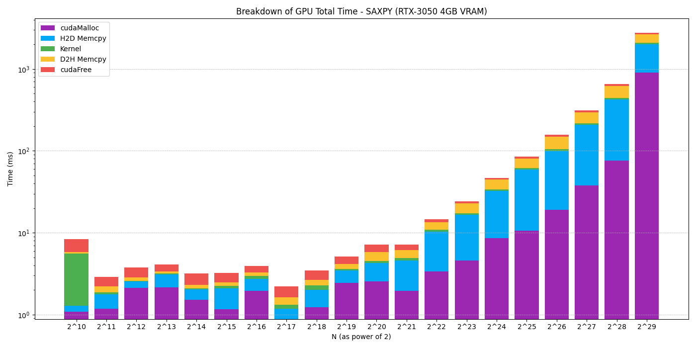

# W04_C13_SAXPY
Course: HW for AI &amp; ML, Week 4 Challenge 13, Benchmarking different SAXPY problem sizes using CUDA.

# SAXPY GPU vs CPU Performance Benchmark

- This experiment explores the performance characteristics of executing the SAXPY (Single-Precision A * X Plus Y) operation on both **CPU and GPU**, using an NVIDIA **RTX-3050 4GB VRAM** GPU and **i5-12450H** CPU. 
- The goal was to identify the **crossover point** (if any) where running SAXPY on the GPU becomes more efficient than the CPU when considering both **kernel execution time** and **end-to-end execution time** (i.e., including memory transfers).

---

## TL;DR

This experiment clearly demonstrates that **raw GPU power is not enough** — understanding the **memory bottlenecks and execution model** is essential when designing GPU-accelerated workloads.

GPU acceleration only delivers real benefits when you:
- **Minimize transfers**
- **Increase arithmetic intensity**
- **Optimize for data locality**

This benchmark serves as a cautionary tale: **More threads ≠ more speed**, unless you architect your program to take full advantage of GPU design.

### When might GPU be worth it?
- If multiple compute-heavy operations are **chained together** without transferring back to host
- If data **stays resident** on GPU across kernels
- If **memory transfers are overlapped** with computation using streams
- If **batching** and **shared memory optimizations** are used

---

## 🔧 Experimental Setup

- **Platform:** WSL2 on Windows with CUDA-capable NVIDIA GPU (RTX-3050 4GB VRAM)
- **Tools Used:**
  - CUDA C/C++ (`nvcc` for compilation)
  - Python (with `pandas` and `matplotlib` for visualization)
- **Problem:** SAXPY on array sizes ranging from \( N = 2^{10} \) to \( N = 2^{30} \), in steps of power-of-two
- **Metrics Recorded:**
  - **GPU Kernel Execution Time**
  - **GPU Total Time** (includes mallocs, cudaMemcpy H2D/D2H, kernel launch)
  - **CPU Time** (loop-based SAXPY)
- **Hardware Used:** 
    - NVIDIA RTX-3050 4GB VRAM
    - Intel i5-12450H CPU

---

## 🧪 Methodology

Wrote a C program (`saxpy_profile_cpuVgpu.cu`) that runs SAXPY:
- On the **GPU**, using a CUDA kernel
- On the **CPU**, using a simple for-loop

Each run measured:
- **Kernel-only time** on GPU using `cudaEvent_t`
- **Total time** including memory allocations and data transfers to/from device
- **CPU time** using `clock_gettime()` (or similar)

Logged this data into a CSV file (`timing_cpuVgpu.csv`) and visualized it using Python and Matplotlib.

---

## 📊 Visualization 1: CPU vs GPU Total Time (Log Scale)

### 📌 Interpretation
- **Green bars**: CPU execution time
- **Red bars**: GPU total execution time (including overheads)
- The y-axis is in **logarithmic scale** to handle the wide range of timing data.

#### 🔍 Observations:
- ***WAIT WHAAAT??, shouldn't GPU be faster than CPU??*** 
- For small `N`, CPU is **vastly faster** due to zero memory transfer overhead.
- Even for mid-sized data (`N = 2^{20}` to `2^{26}`), GPU is **still slower overall**.
- **GPU total time never beats CPU time** in this experiment — even at \( 2^{30} \) (1 billion elements), GPU total time is **much higher** than CPU time.
- To figure out why, we need to look at the **GPU kernel time** and **GPU total time** separately.
- Let's see that in the next plot.

---

## 📊 Visualization 2: CPU Time vs GPU Kernel Time vs GPU Total Time

### 📌 Interpretation
- **Green**: CPU time (also serves as CPU kernel time)
- **Blue**: GPU kernel execution time
- **Red**: GPU total time (kernel + memory management + transfers)

#### 🔍 Observations:
- GPU kernel time is **consistently much lower** than CPU time — up to **100x faster**.
- But GPU total time remains **much higher** than CPU time until extremely large values of `N` (and still doesn't win).
- This confirms that **data transfer and setup overhead dominate** the GPU execution pipeline for SAXPY.

---

## 📈 Data Summary (Selected Points)

| PowerOf2 | N           | GPU Kernel (ms) | GPU Total (ms) | CPU Time (ms) |
|----------|-------------|------------------|----------------|----------------|
| 10       | 1024        | 1.4561           | 2.8060         | 0.0155         |
| 20       | 1,048,576   | 0.2503           | 24.8902        | 13.0298        |
| 25       | 33,554,432  | 2.3524           | 653.1412       | 412.4652       |
| 30       | 1,073,741,824 | 673.4054        | 72861.9375     | 15282.4374     |

---

## 📊 Visualization 3: Breakdown of GPU execution components

---

## 🔍 Component-Wise Insights

### 🔹 1. **GPU Kernel Time**
- The kernel is consistently **very fast** — typically under **1 ms** until `N = 2^25`.
- Even for **massive arrays (up to 500 million elements)**, it only takes **~100 ms** at worst.
- **GPU compute is not the bottleneck**.

### 🔹 2. **Memory Allocation and Deallocation (cudaMalloc + cudaFree)**
- `cudaMalloc` + `cudaFree` times are **non-trivial** even for small sizes.
- At `2^29`, `cudaMalloc = 897.8 ms`, `cudaFree = 107.8 ms` → **~1000 ms** just in memory setup and cleanup!
- **CUDA memory allocation overhead is substantial**, especially at high `N`.

### 🔹 3. **Host-to-Device (H2D) and Device-to-Host (D2H) Copies**
- These are **the real bottleneck**.
- At `2^25`, total memcpy time (H2D + D2H) is ~**67 ms**; at `2^29`, it balloons to **~1655 ms**.
- Even before reaching huge arrays, memcpy is **already the largest contributor**.
- **Communication latency dominates GPU performance**.

---

## ✅ Final Conclusion

> **The GPU kernel is dramatically faster than the CPU kernel**, but unless the **communication and memory transfer overhead** is minimized or amortized across larger workloads, the **CPU remains faster overall** in real-world total execution time.

### 🔍 Why?
- GPU time includes:
  - `cudaMalloc`
  - `cudaMemcpy` (Host-to-Device, Device-to-Host)
  - Synchronization
- CPU time is purely loop compute — no transfers needed.

---

## 🧠 Next Steps

To improve GPU viability:
- 🔄 Use **pinned memory** for faster transfers
- ⛓️ Chain multiple kernels without round-tripping
- 🔀 Overlap transfers + compute using CUDA streams
- 📦 Batch operations to amortize memory cost

---

## 📁 Files

- `saxpy_profile_cpuVgpu.cu`: Benchmark program (CPU + GPU)
- `timing_cpuVgpu.csv`: Logged timing data
- `plot_cpuVgpu_graph.py`: For CPU vs GPU total time plot

---
